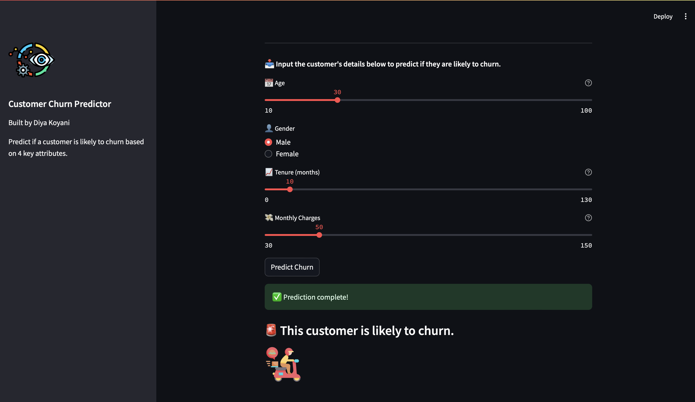

# Customer-Churn-Analysis-using-AI-
This project aims to predict customer churn for a telecom company using supervised machine learning models. It involves data preprocessing, exploratory data analysis, model training (Random Forest, Logistic Regression), and performance evaluation. A simple Streamlit app is also included for real-time churn prediction based on user input.

